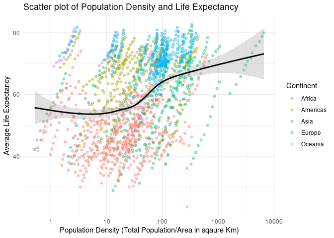

Effect of Population Density on Life Expectancy
================
Clara Fong
2021-03-07

  - [Exploring Gap Minder Data](#exploring-gap-minder-data)
      - [Population and Life
        Expectancy](#population-and-life-expectancy)
      - [Population Desnity and Life
        Expectancy](#population-desnity-and-life-expectancy)
      - [Session info](#session-info)

# Exploring Gap Minder Data

Below are two graphs: one is a scatter plot of the total population of
all countries and their average life expectancy, and the second graph is
a scatter plot the population *density* and total life expectancy. The
final statistical output is a basic linear regression model that
attempts to predict life expectancy based on population density
outcomes.

## Population and Life Expectancy

<!-- -->

Recreating the graph from our [assignment
page](https://cfss.uchicago.edu/homework/webdata/), we can see that
generally, as population increases, so does average life expectancy. The
assignment asks us to use `geonames` data to conduct this same
scatterplot on population *density* and average life expectancy. That
output can be found in the next section below.

## Population Desnity and Life Expectancy

<!-- -->

As we can see, this output is not perfectly linear, and certainly not as
linear as the first plot (population and life expectancy). Below, we can
also look at how each plot compares to each other by continent:

<!-- -->

From these plots, it is clear that this relationship differs across the
continents based on both data availability and overall trends. For
example, Asia shows the most close to linear trend between population
dendity and life expectancy, but Europe has an opposite effect after a
certain population size.

Another way we can preliminarily analyze the data is to see to whether
we can model statistically significant a linear regression using the
population density and life expectancy data, even if the total data set
relationship is not perfectly linear.

Below is the output of a basic linear regression model calculated in
base R:

| Term        |  Estimate | Standard Error |  Statistic | P-Value |
| :---------- | --------: | -------------: | ---------: | ------: |
| (Intercept) | 58.717842 |      0.3459406 | 169.733867 |       0 |
| pop\_den    |  0.006155 |      0.0008720 |   7.058659 |       0 |

With a p-value at \<0.01, this model is statistically significant and
seems to support a postitive linear relationship between the two
variables. We can also test this same linear regression using
`tidymodels` to test and predict on the same data then calculate the
RMSE for the model.

| Output | Estimator | Estimate |
| :----- | :-------- | -------: |
| rmse   | standard  | 12.87308 |

This root mean squared tells us that the model’s prediction has an
average deviation of around 12.87.

## Session info

``` r
devtools::session_info()
```

    ## ─ Session info ───────────────────────────────────────────────────────────────
    ##  setting  value                               
    ##  version  R version 4.0.1 (2020-06-06)        
    ##  os       Red Hat Enterprise Linux 8.3 (Ootpa)
    ##  system   x86_64, linux-gnu                   
    ##  ui       X11                                 
    ##  language (EN)                                
    ##  collate  en_US.UTF-8                         
    ##  ctype    en_US.UTF-8                         
    ##  tz       America/Chicago                     
    ##  date     2021-03-07                          
    ## 
    ## ─ Packages ───────────────────────────────────────────────────────────────────
    ##  package     * version    date       lib source                        
    ##  assertthat    0.2.1      2019-03-21 [2] CRAN (R 4.0.1)                
    ##  backports     1.2.1      2020-12-09 [2] CRAN (R 4.0.1)                
    ##  broom       * 0.7.3      2020-12-16 [2] CRAN (R 4.0.1)                
    ##  callr         3.5.1      2020-10-13 [2] CRAN (R 4.0.1)                
    ##  cellranger    1.1.0      2016-07-27 [2] CRAN (R 4.0.1)                
    ##  class         7.3-17     2020-04-26 [2] CRAN (R 4.0.1)                
    ##  cli           2.2.0      2020-11-20 [2] CRAN (R 4.0.1)                
    ##  codetools     0.2-16     2018-12-24 [2] CRAN (R 4.0.1)                
    ##  colorspace    2.0-0      2020-11-11 [2] CRAN (R 4.0.1)                
    ##  countrycode * 1.2.0      2020-05-22 [2] CRAN (R 4.0.1)                
    ##  crayon        1.3.4      2017-09-16 [2] CRAN (R 4.0.1)                
    ##  DBI           1.1.0      2019-12-15 [2] CRAN (R 4.0.1)                
    ##  dbplyr        2.0.0      2020-11-03 [2] CRAN (R 4.0.1)                
    ##  desc          1.2.0      2018-05-01 [2] CRAN (R 4.0.1)                
    ##  devtools      2.3.2      2020-09-18 [2] CRAN (R 4.0.1)                
    ##  dials       * 0.0.9      2020-09-16 [2] CRAN (R 4.0.1)                
    ##  DiceDesign    1.8-1      2019-07-31 [2] CRAN (R 4.0.1)                
    ##  digest        0.6.27     2020-10-24 [2] CRAN (R 4.0.1)                
    ##  dplyr       * 1.0.2      2020-08-18 [2] CRAN (R 4.0.1)                
    ##  ellipsis      0.3.1      2020-05-15 [2] CRAN (R 4.0.1)                
    ##  evaluate      0.14       2019-05-28 [2] CRAN (R 4.0.1)                
    ##  fansi         0.4.1      2020-01-08 [2] CRAN (R 4.0.1)                
    ##  farver        2.0.3      2020-01-16 [2] CRAN (R 4.0.1)                
    ##  forcats     * 0.5.0      2020-03-01 [2] CRAN (R 4.0.1)                
    ##  foreach       1.5.1      2020-10-15 [2] CRAN (R 4.0.1)                
    ##  fs            1.5.0      2020-07-31 [2] CRAN (R 4.0.1)                
    ##  furrr         0.2.1      2020-10-21 [2] CRAN (R 4.0.1)                
    ##  future        1.21.0     2020-12-10 [2] CRAN (R 4.0.1)                
    ##  gapminder     0.3.0      2017-10-31 [2] CRAN (R 4.0.1)                
    ##  generics      0.1.0      2020-10-31 [2] CRAN (R 4.0.1)                
    ##  geonames    * 0.999      2019-02-19 [2] CRAN (R 4.0.1)                
    ##  ggplot2     * 3.3.3      2020-12-30 [2] CRAN (R 4.0.1)                
    ##  globals       0.14.0     2020-11-22 [2] CRAN (R 4.0.1)                
    ##  glue          1.4.2      2020-08-27 [2] CRAN (R 4.0.1)                
    ##  gower         0.2.2      2020-06-23 [2] CRAN (R 4.0.1)                
    ##  GPfit         1.0-8      2019-02-08 [2] CRAN (R 4.0.1)                
    ##  gtable        0.3.0      2019-03-25 [2] CRAN (R 4.0.1)                
    ##  haven         2.3.1      2020-06-01 [2] CRAN (R 4.0.1)                
    ##  here        * 1.0.1      2020-12-13 [2] CRAN (R 4.0.1)                
    ##  highr         0.8        2019-03-20 [2] CRAN (R 4.0.1)                
    ##  hms           0.5.3      2020-01-08 [2] CRAN (R 4.0.1)                
    ##  htmltools     0.4.0      2019-10-04 [2] CRAN (R 4.0.1)                
    ##  httr          1.4.2      2020-07-20 [2] CRAN (R 4.0.1)                
    ##  infer       * 0.5.3      2020-07-14 [2] CRAN (R 4.0.1)                
    ##  ipred         0.9-9      2019-04-28 [2] CRAN (R 4.0.1)                
    ##  iterators     1.0.13     2020-10-15 [2] CRAN (R 4.0.1)                
    ##  janeaustenr   0.1.5      2017-06-10 [2] CRAN (R 4.0.1)                
    ##  jsonlite      1.7.2      2020-12-09 [2] CRAN (R 4.0.1)                
    ##  knitr         1.30       2020-09-22 [2] CRAN (R 4.0.1)                
    ##  labeling      0.4.2      2020-10-20 [2] CRAN (R 4.0.1)                
    ##  lattice       0.20-41    2020-04-02 [2] CRAN (R 4.0.1)                
    ##  lava          1.6.8.1    2020-11-04 [2] CRAN (R 4.0.1)                
    ##  lhs           1.1.1      2020-10-05 [2] CRAN (R 4.0.1)                
    ##  lifecycle     0.2.0      2020-03-06 [2] CRAN (R 4.0.1)                
    ##  listenv       0.8.0      2019-12-05 [2] CRAN (R 4.0.1)                
    ##  lubridate     1.7.9.2    2020-11-13 [2] CRAN (R 4.0.1)                
    ##  magrittr      2.0.1      2020-11-17 [2] CRAN (R 4.0.1)                
    ##  MASS          7.3-51.6   2020-04-26 [2] CRAN (R 4.0.1)                
    ##  Matrix        1.2-18     2019-11-27 [2] CRAN (R 4.0.1)                
    ##  memoise       1.1.0      2017-04-21 [2] CRAN (R 4.0.1)                
    ##  mgcv          1.8-31     2019-11-09 [2] CRAN (R 4.0.1)                
    ##  modeldata   * 0.1.0      2020-10-22 [2] CRAN (R 4.0.1)                
    ##  modelr        0.1.8      2020-05-19 [2] CRAN (R 4.0.1)                
    ##  munsell       0.5.0      2018-06-12 [2] CRAN (R 4.0.1)                
    ##  nlme          3.1-148    2020-05-24 [2] CRAN (R 4.0.1)                
    ##  nnet          7.3-14     2020-04-26 [2] CRAN (R 4.0.1)                
    ##  parallelly    1.22.0     2020-12-13 [2] CRAN (R 4.0.1)                
    ##  parsnip     * 0.1.4      2020-10-27 [2] CRAN (R 4.0.1)                
    ##  pillar        1.4.7      2020-11-20 [2] CRAN (R 4.0.1)                
    ##  pkgbuild      1.2.0      2020-12-15 [2] CRAN (R 4.0.1)                
    ##  pkgconfig     2.0.3      2019-09-22 [2] CRAN (R 4.0.1)                
    ##  pkgload       1.1.0      2020-05-29 [2] CRAN (R 4.0.1)                
    ##  plyr          1.8.6      2020-03-03 [2] CRAN (R 4.0.1)                
    ##  prettyunits   1.1.1      2020-01-24 [2] CRAN (R 4.0.1)                
    ##  pROC          1.16.2     2020-03-19 [2] CRAN (R 4.0.1)                
    ##  processx      3.4.5      2020-11-30 [2] CRAN (R 4.0.1)                
    ##  prodlim       2019.11.13 2019-11-17 [2] CRAN (R 4.0.1)                
    ##  ps            1.5.0      2020-12-05 [2] CRAN (R 4.0.1)                
    ##  purrr       * 0.3.4      2020-04-17 [2] CRAN (R 4.0.1)                
    ##  R6            2.5.0      2020-10-28 [2] CRAN (R 4.0.1)                
    ##  rcfss       * 0.2.1      2021-01-05 [2] Github (uc-cfss/rcfss@36e77a2)
    ##  Rcpp          1.0.5      2020-07-06 [2] CRAN (R 4.0.1)                
    ##  readr       * 1.4.0      2020-10-05 [2] CRAN (R 4.0.1)                
    ##  readxl        1.3.1      2019-03-13 [2] CRAN (R 4.0.1)                
    ##  recipes     * 0.1.15     2020-11-11 [2] CRAN (R 4.0.1)                
    ##  remotes       2.2.0      2020-07-21 [2] CRAN (R 4.0.1)                
    ##  reprex        0.3.0      2019-05-16 [2] CRAN (R 4.0.1)                
    ##  rjson         0.2.20     2018-06-08 [2] CRAN (R 4.0.1)                
    ##  rlang         0.4.10     2020-12-30 [2] CRAN (R 4.0.1)                
    ##  rmarkdown     2.6        2020-12-14 [2] CRAN (R 4.0.1)                
    ##  rpart         4.1-15     2019-04-12 [2] CRAN (R 4.0.1)                
    ##  rprojroot     2.0.2      2020-11-15 [2] CRAN (R 4.0.1)                
    ##  rsample     * 0.0.8      2020-09-23 [2] CRAN (R 4.0.1)                
    ##  rstudioapi    0.13       2020-11-12 [2] CRAN (R 4.0.1)                
    ##  rvest         0.3.6      2020-07-25 [2] CRAN (R 4.0.1)                
    ##  scales      * 1.1.1      2020-05-11 [2] CRAN (R 4.0.1)                
    ##  sessioninfo   1.1.1      2018-11-05 [2] CRAN (R 4.0.1)                
    ##  SnowballC     0.7.0      2020-04-01 [2] CRAN (R 4.0.1)                
    ##  stringi       1.5.3      2020-09-09 [2] CRAN (R 4.0.1)                
    ##  stringr     * 1.4.0      2019-02-10 [2] CRAN (R 4.0.1)                
    ##  survival      3.1-12     2020-04-10 [2] CRAN (R 4.0.1)                
    ##  testthat      3.0.1      2020-12-17 [2] CRAN (R 4.0.1)                
    ##  tibble      * 3.0.4      2020-10-12 [2] CRAN (R 4.0.1)                
    ##  tidymodels  * 0.1.2      2020-11-22 [2] CRAN (R 4.0.1)                
    ##  tidyr       * 1.1.2      2020-08-27 [2] CRAN (R 4.0.1)                
    ##  tidyselect    1.1.0      2020-05-11 [2] CRAN (R 4.0.1)                
    ##  tidytext    * 0.2.6      2020-09-20 [2] CRAN (R 4.0.1)                
    ##  tidyverse   * 1.3.0      2019-11-21 [2] CRAN (R 4.0.1)                
    ##  timeDate      3043.102   2018-02-21 [2] CRAN (R 4.0.1)                
    ##  tokenizers    0.2.1      2018-03-29 [2] CRAN (R 4.0.1)                
    ##  tune        * 0.1.2      2020-11-17 [2] CRAN (R 4.0.1)                
    ##  usethis       2.0.0      2020-12-10 [2] CRAN (R 4.0.1)                
    ##  vctrs         0.3.6      2020-12-17 [2] CRAN (R 4.0.1)                
    ##  withr         2.3.0      2020-09-22 [2] CRAN (R 4.0.1)                
    ##  workflows   * 0.2.1      2020-10-08 [2] CRAN (R 4.0.1)                
    ##  xfun          0.19       2020-10-30 [2] CRAN (R 4.0.1)                
    ##  xml2          1.3.2      2020-04-23 [2] CRAN (R 4.0.1)                
    ##  yaml          2.2.1      2020-02-01 [2] CRAN (R 4.0.1)                
    ##  yardstick   * 0.0.7      2020-07-13 [2] CRAN (R 4.0.1)                
    ## 
    ## [1] /home/cmfong/R/x86_64-pc-linux-gnu-library/4.0
    ## [2] /opt/R/4.0.1/lib/R/library
